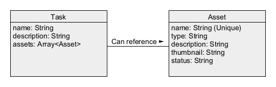

# Shitgrid

Definitely not Kitsu

## Components

### Website

The website is designed to imitate Shotgrid, with basic abilities to create and view tasks and assets.

When an asset is added via the frontend, the backend creates a folder on disk.

These folders are used by the Blender addon as described below.

### Blender Addon

The Blender addon is responsible for publishing, version control and building.

Once an asset folder is added, the addon will publish Blender files into that folder.

The build scripts take published files and consolidate them into single assets.

## Architecture

### Website Backend

The backend is written in JavaScript using Express.

It doesn't use a database for now, just basic file storage in `assets.json` and `tasks.json`.

### Website Frontend

The frontend is written in JavaScript and JSX using React.

### Blender Addon

The Blender addon is written in Python.

## Environment Variables

### Website

- Set `SHITGRID_WEB_DB` to the folder you want the JSON files to be stored, for example `C:/web_db`.
- Set `REACT_APP_SHITGRID_SERVER` to whatever URL the backend is hosted on, for example `http://localhost`.
- Set `REACT_APP_SHITGRID_PORT` to whatever port the backend is hosted on, for example `5000`.

### Blender Addon

- Set `SHITGRID_BLEND_DB` to the folder you want Blender files to be saved, for example `C:/blender_db`.

## Installation

### Website Frontend

1. Install NPM and Node.js
2. Go to `website/client`
3. Run `npm install`
4. Run `npm start`

### Website Backend

1. Install NPM and Node.js
2. Go to `website/server`
3. Run `npm install`
4. Run `npm start`

### Blender Addon

1. Open Blender Preferences
2. Install the file in the `blender_addon` folder
3. Press `N` to open the menu
